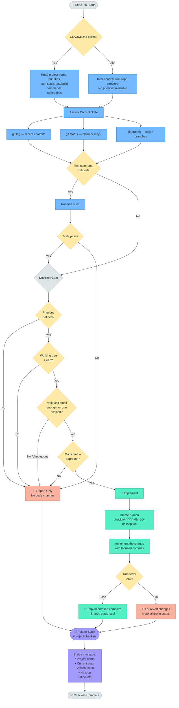

# Check-in Decision Tree

```mermaid
flowchart TD
    START([🚀 Check-in Starts]) --> READ_CLAUDE{CLAUDE.md exists?}

    %% Step 1: Project Context
    READ_CLAUDE -->|Yes| PARSE[Read project name, priorities,\ntech stack, test/build commands,\nconstraints]
    READ_CLAUDE -->|No| NO_CLAUDE[Infer context from repo structure\nNo priorities available]

    %% Step 2: Assess State
    PARSE --> ASSESS[Assess Current State]
    NO_CLAUDE --> ASSESS

    ASSESS --> GIT_LOG[git log — recent commits]
    ASSESS --> GIT_STATUS[git status — clean or dirty?]
    ASSESS --> GIT_BRANCH[git branch — active branches]

    GIT_LOG --> HAS_TESTS{Test command\ndefined?}
    GIT_STATUS --> HAS_TESTS
    GIT_BRANCH --> HAS_TESTS

    HAS_TESTS -->|Yes| RUN_TESTS[Run test suite]
    HAS_TESTS -->|No| DECIDE_GATE{Decision Gate}

    RUN_TESTS --> TESTS_PASS{Tests pass?}
    TESTS_PASS -->|Yes| DECIDE_GATE
    TESTS_PASS -->|No| REPORT_ONLY[📝 Report Only\nNo code changes]

    %% Step 3: Decision Gate
    DECIDE_GATE --> HAS_PRIORITIES{Priorities\ndefined?}

    HAS_PRIORITIES -->|No| REPORT_ONLY
    HAS_PRIORITIES -->|Yes| CLEAN_TREE{Working tree\nclean?}

    CLEAN_TREE -->|No| REPORT_ONLY
    CLEAN_TREE -->|Yes| TASK_SIZE{Next task small\nenough for one\nsession?}

    TASK_SIZE -->|No / Ambiguous| REPORT_ONLY
    TASK_SIZE -->|Yes| CONFIDENT{Confident in\napproach?}

    CONFIDENT -->|No| REPORT_ONLY
    CONFIDENT -->|Yes| IMPLEMENT[🔨 Implement]

    %% Implementation path
    IMPLEMENT --> CREATE_BRANCH[Create branch\ncheckin/YYYY-MM-DD-description]
    CREATE_BRANCH --> WRITE_CODE[Implement the change\nwith focused commits]
    WRITE_CODE --> POST_TESTS{Run tests\nagain}

    POST_TESTS -->|Pass| DONE_IMPL[✅ Implementation complete\nBranch stays local]
    POST_TESTS -->|Fail| REVERT[Fix or revert changes\nNote failure in status]

    DONE_IMPL --> SLACK
    REVERT --> SLACK

    %% Report-only path
    REPORT_ONLY --> SLACK

    %% Step 4: Post to Slack
    SLACK([💬 Post to Slack\n#project-checkins])
    SLACK --> MSG[Status message:\n• Project name\n• Current state\n• Action taken\n• Next up\n• Blockers]

    MSG --> FINISH([✅ Check-in Complete])

    %% Styling
    classDef decision fill:#ffeaa7,stroke:#fdcb6e,color:#2d3436
    classDef action fill:#74b9ff,stroke:#0984e3,color:#2d3436
    classDef implement fill:#55efc4,stroke:#00b894,color:#2d3436
    classDef report fill:#fab1a0,stroke:#e17055,color:#2d3436
    classDef slack fill:#a29bfe,stroke:#6c5ce7,color:#2d3436
    classDef terminal fill:#dfe6e9,stroke:#b2bec3,color:#2d3436

    class READ_CLAUDE,HAS_TESTS,TESTS_PASS,HAS_PRIORITIES,CLEAN_TREE,TASK_SIZE,CONFIDENT,POST_TESTS decision
    class PARSE,NO_CLAUDE,ASSESS,GIT_LOG,GIT_STATUS,GIT_BRANCH,RUN_TESTS action
    class IMPLEMENT,CREATE_BRANCH,WRITE_CODE,DONE_IMPL implement
    class REPORT_ONLY,REVERT report
    class SLACK,MSG slack
    class START,FINISH,DECIDE_GATE terminal
```
